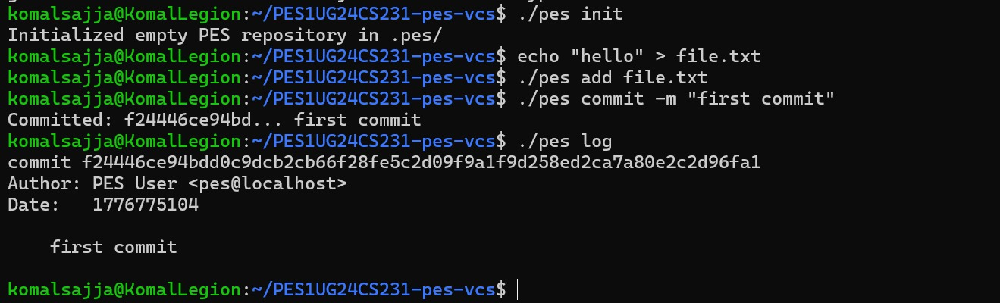
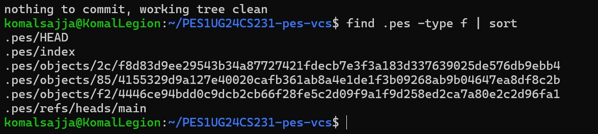
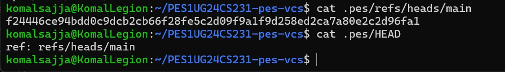
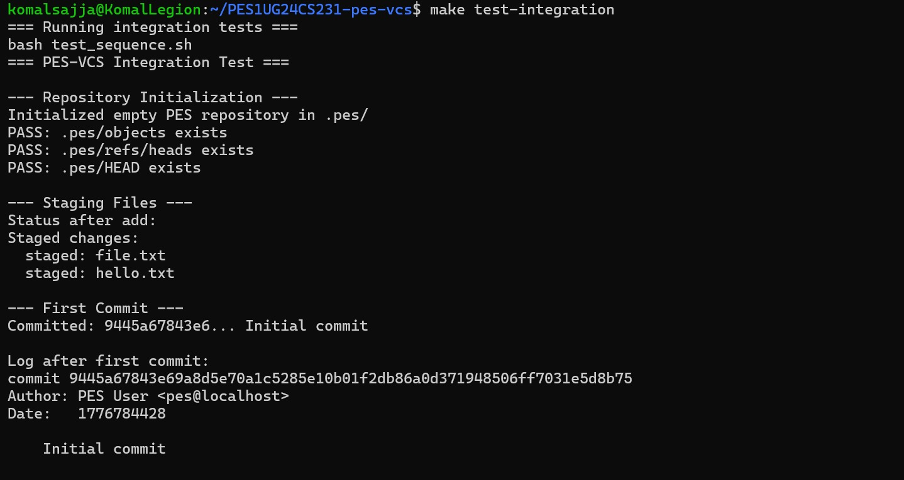
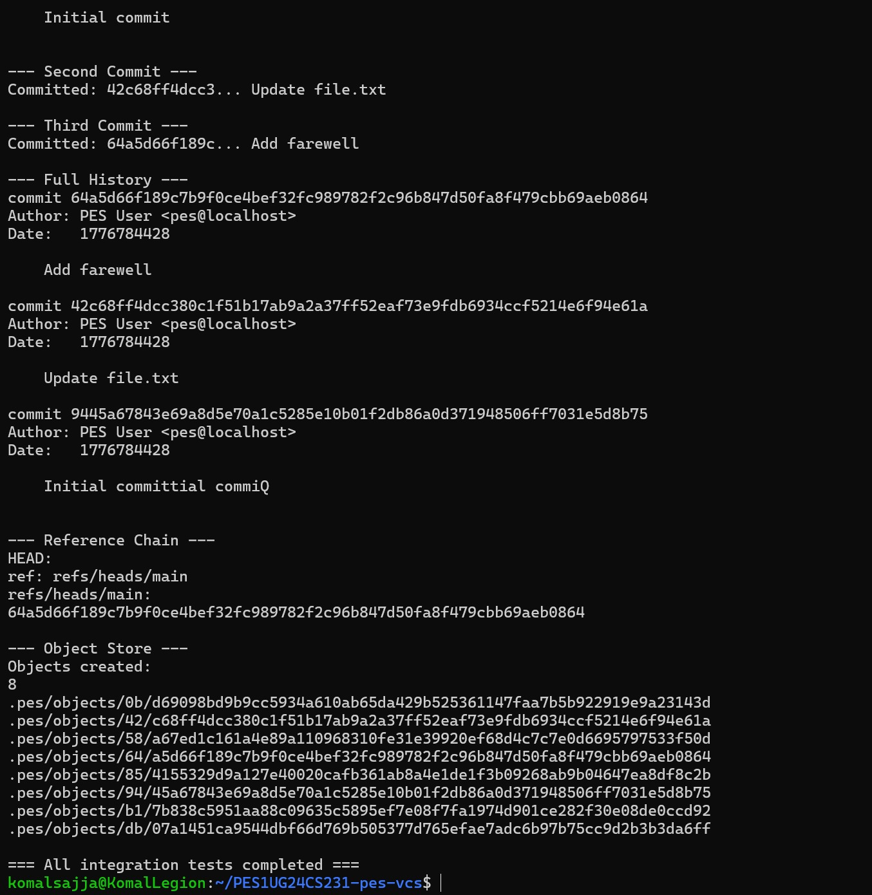

# PES-VCS (Version Control System)

## Overview

This project implements a simplified version of a version control system (similar to Git) from scratch in C. It demonstrates core operating system and filesystem concepts such as content-addressable storage, tree structures, staging areas, and commit history tracking.

The system supports:
- pes init → Initialize repository
- pes add <file> → Stage files
- pes status → Show staged files
- pes commit -m "msg" → Create commit
- pes log → View commit history

---

## Phase 1 – Object Storage

Implemented content-addressable storage using SHA-256 hashing.

### Concepts
- Hash-based storage
- Deduplication
- Atomic writes
- Directory sharding

### Screenshots

Test Output  

Object Storage Structure  

---

## Phase 2 – Tree Objects

Implemented tree structures to represent directories.

### Concepts
- Tree serialization
- Recursive structure
- Deterministic output

### Screenshots

Tree Test Output  

Tree Object Hex Dump  

---

## Phase 3 – Index (Staging Area)

Implemented a staging area to track files before committing.

### Concepts
- Index file parsing
- Metadata tracking
- Atomic updates

### Screenshots

Add Command + Index File  

---

## Phase 4 – Commit System

Implemented commit creation and history tracking.

### Concepts
- Tree → Commit linkage
- Parent commit tracking
- HEAD updates
- Commit traversal

### Screenshots

Commit + Log Output  

Screenshot 4B: Object Growth

Screenshot 4C: HEAD and Branch Reference

---

### Final Integration Test (Part 1)

### Final Integration Test (Part 2)

## Analysis Questions

### Q5.1: How would you implement pes checkout <branch>?

- Update `.pes/HEAD` to point to the selected branch
- Read commit hash from `.pes/refs/heads/<branch>`
- Load tree object for that commit
- Reconstruct working directory from tree

Complexity:
- Must overwrite files safely
- Handle uncommitted changes
- Avoid data loss

---

### Q5.2: Detecting dirty working directory

- Compare working file hash with index hash
- If mismatch → file modified
- If modified → block checkout

---

### Q5.3: Detached HEAD

- HEAD points directly to a commit
- New commits are not attached to a branch

Recovery:
- Create a new branch pointing to that commit

---

### Q6.1: Garbage Collection

Algorithm:
1. Start from branch heads
2. Traverse all commits recursively
3. Mark reachable objects
4. Delete unreachable ones

Use:
- Hash set to track visited objects

---

### Q6.2: GC Race Condition

Problem:
- GC may delete objects while commit is being created

Solution:
- Lock repository during GC
- Use safe reference updates
- Delay deletion until objects are stable

---

## Submission Notes

- All 4 phases completed
- Minimum 5 commits per phase maintained
- Screenshots included
- Project fully functional

---

## Author

Komal S Sajja
PES1UG24CS231
D-SECTION
