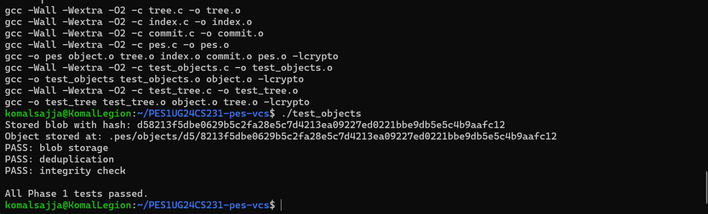
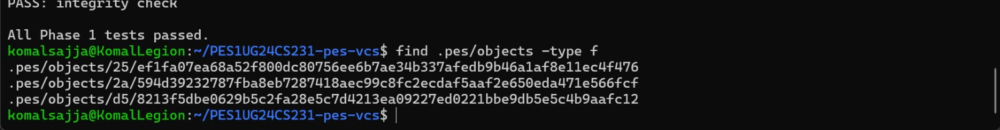
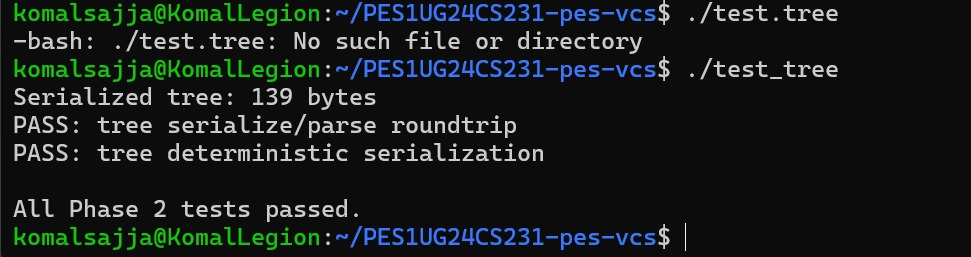
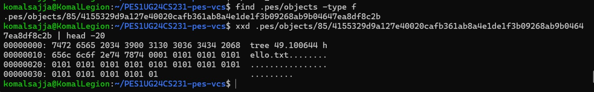
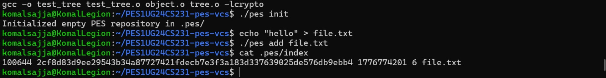

# PES-VCS (Version Control System)

## Phase 1 - Object Storage

### Screenshot 1A: Test Output

### Screenshot 1B: Object Storage Structure

---

## Phase 2 - Tree Objects

### Screenshot 2A: Test Output

### Screenshot 2B: Raw Tree Object (Hex Dump)

## Phase 3 - Index (Staging)

### Add Command and index file

